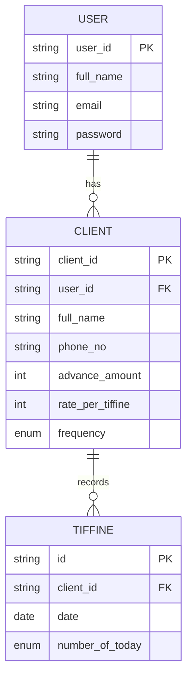

## Problem Statement

Most of the working professionals and students living away from their home they do not proper arrangements to cook food, here comes the the role of the tiffine service provider.

The Tiffine service provider which provide the tiffines to the those working professionals and students but do not have the proper managements system to maintain the records of the customers and the daily tiffine distributions.

## Solution

Here come the solution for this which a robust, lightweight and scable mobile app where the owner maintain the records of the customers and their corrosponding tiffine on the basis of their frequency.

## Requirements

### Functional Requirements

* Login/register
* Create new user with details
* Maintaining daily records

### Non Functional Requirements

* Fast api response (2ms)
* Interesting and Impressive UI/UX
* Smooth performance

## Entity Relation Diagram

